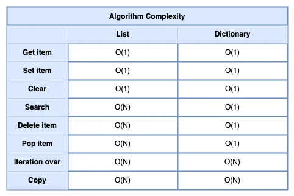

## Dictionary

Continuing the previous point, searching for an element in a dictionary takes constant time, with an algorithmic complexity of `O(1)`. 
This complexity applies to most dictionary operations, making dictionaries faster for data storage compared to other collections. 
Here’s a comparison of the algorithmic complexity for operations in dictionaries and lists:



This is why data is stored in a class as a dictionary. A quick glance below shows that the class has a magic `__dict__` attribute:

```python
class User:
    def __init__(self, name: str, age: int) -> None:
        self.name = name
        self.age = age


first_user = User("Mariia", 19)
print(first_user.__dict__)
# {"name": "Mariia", "age": 19}
```
