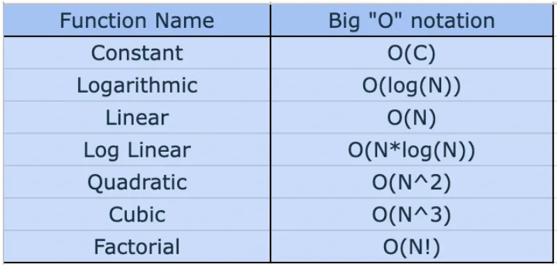
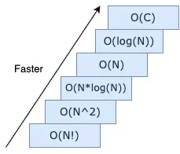
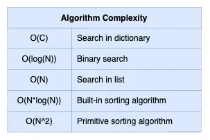

# Dictionary Advanced

Heute tauchen wir tiefer in Dictionaries ein.

---

[](#algorithm-complexity)

## Algorithm Complexity

Die **Algorithmuskomplexität** misst, wie die Anzahl der Operationen in einem Algorithmus von der Größe der Eingabedaten `n` abhängt. Wenn ein Algorithmus beispielsweise eine konstante Anzahl von Operationen unabhängig von der Eingabegröße durchführt, hat er eine konstante Zeitkomplexität, die als $f(n) = C$ bezeichnet wird.

Wenn die Anzahl der Operationen direkt proportional zur Eingabegröße ist, ist die Funktion **linear** und kann als $f(n) = a*n + b$ ausgedrückt werden, wobei $a$ und $b$ Konstanten sind. Dieser Ausdruck repräsentiert die **Komplexität der Funktion.** Neben der linearen Komplexität umfassen die Komplexitätstypen auch quadratische, logarithmische und polynomielle.

Wichtig ist, dass Konstanten nur minimale Auswirkungen auf die algorithmische Komplexität haben. Zum Beispiel kann eine Funktion $a*n^2 + b*n + C$ mit einer großen Konstante $C$ (z. B. 1.000.000) immer noch als quadratisch betrachtet werden, vereinfacht zu $f(n) = n^2$. Die Abhängigkeit von der Größe der Eingabedaten ist entscheidend.

Die algorithmische Komplexität wird oft mit der **Big "O" Notation** — **O(N)** aufgezeichnet. Hier sind "O"-Notationen für verschiedene Arten von Funktionen:



Betrachten wir Beispiele für Funktionen und deren Ausführungszeit:

```python
def add(a: int, b: int) -> int:
    return a + b
````

Diese Funktion führt eine Addition in konstanter Zeit durch — `total = a + b` ist $О(1)$. Die Gesamtkomplexität der Funktion ist somit $O(1)$. Um diese Funktion komplexer zu machen, können wir eine weitere Operation hinzufügen, wie z. B. `print()`:

```python
def add(a: int, b: int) -> int:
    total = a + b 
    print(total)
    return total
```

Hier werden zwei Operationen ausgeführt: Addition in konstanter Zeit und `print()` in konstanter Zeit. Logischerweise ist die Komplexität der Funktion nun $O(1) + O(1) = 2*O(1)$. Da $2$ aber auch eine Konstante ist, ist die algorithmische Komplexität gleich der Summe der Konstanten, was ebenfalls eine Konstante ist — $2*O(1) \sim O(1)$.

Hier ist eine weitere Funktion:

```python
def print_list(ls: list) -> None:
    for item in ls:
        print(item)
```

Diese Funktion enthält eine Schleife, die Elemente einer Liste durchläuft und eine Aktion für jedes Element ausführt. Wenn die Liste $n$ Elemente hat, ist die Anzahl der Operationen $n$, was zu einer linearen algorithmischen Komplexität führt — $O(n)$. Betrachten wir eine ähnliche Funktion, die eine Matrix, also eine Liste von Listen, ausgibt:

```python
from typing import List


def print_matrix(matrix: List[List[int]]) -> None:
    matrix_len = len(matrix)
    for i in range(matrix_len):
        for j in range(matrix_len):
            print(matrix[i][j])
```

Für jede Liste wird durch deren Elemente iteriert. Wenn wir beispielsweise eine Liste mit drei Listen haben, von denen jede drei Elemente enthält, geben wir insgesamt $9$ Elemente aus. Im Allgemeinen ist die Komplexität des Algorithmus quadratisch, wenn eine Schleife in einer anderen Schleife verschachtelt ist, was als $O(N^2)$ bezeichnet wird:

Hier sind einige gängige Beispiele für Algorithmen, die bestimmte algorithmische Komplexitäten aufweisen:





[](https://www.google.com/search?q=%23memory-complexity)

### Memory Complexity

Die **Speicherkomplexität** ist eine weitere Methode zur Schätzung der algorithmischen Komplexität. Im Gegensatz zur vorherigen Methode hängt diese Komplexität von der Größe des Arbeitsspeichers (der Arbeitspeicher) des Algorithmus ab. Betrachten wir ein Beispiel und bestimmen die algorithmische Komplexität:

```python
def find_sum_in_range(numbers: int) -> int:
	amount = 0
	for number in range(numbers):
		amount += number
	return amount
```

Hier ist die Konstante `numbers` eine Ganzzahleingabe, die $O(1)$ Speicher benötigt; die Variablen `number` und `amount` sind ebenfalls Konstanten, die $O(1)$ Speicher benötigen. Insgesamt beträgt der benötigte Speicher somit $O(1) + O(1) + O(1) = 3*O(1)$, was äquivalent zu $O(1)$ ist.

```
```