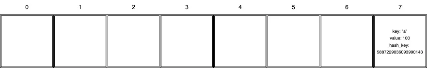
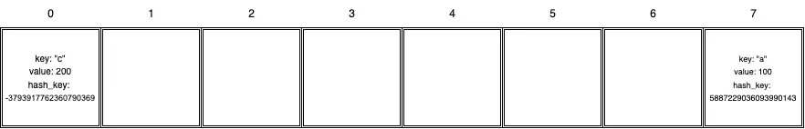

### Kollision (Collision)

Was passiert, wenn zwei verschiedene Schlüssel oder Objekte denselben Index vom Hash erhalten? Ein solcher Fall hat
einen speziellen Namen – die **Kollision**. Schauen wir uns an, wie sich die Tabelle in diesem Fall verhält. Wir fügen
den ersten Wert hinzu, der den Schlüssel `"a"` und den Wert `100` hat:

1. Finde den Hash-Wert des Schlüssels:

```python
hash_key = hash(key)  # hash_key = 5887229036093990143
```

2. Finde den Index:

<!-- end list -->

```python
index = hash_key % 8  # index = 7
```

3. Der Wert wird in die Zelle geschrieben:



Als Nächstes schreiben wir den Wert `200` mit dem Schlüssel `"c"` in die Tabelle:

1. Finde den Hash-Wert des Schlüssels:

<!-- end list -->

```python
hash_key = hash(key)  # hash_key = -3793917762360790369
```

2. Finde den Index:

<!-- end list -->

```python
index = hash_key % 8  # index = 7
```

3. Hoppla, die Zelle Nummer `7` ist bereits belegt. Am besten finden wir nun die nächste freie Zelle, indem wir uns von
   links nach rechts bewegen. Das heißt, wenn wir die 7. Zelle prüfen und diese besetzt ist, gehen wir zu Zelle `0`,
   dann zu `1`, dann zu `2` und so weiter, bis eine freie Zelle erscheint. In unserem Fall ist die Zelle mit Index `0`
   frei, also schreiben wir den Wert dorthin:



Tatsächlich funktionieren Hash-Tabellen in Python etwas anders, wenn eine Kollision auftritt, da Python nicht nach der
nächsten freien Zelle sucht, sondern **zufällig eine freie Zelle auswählt.** Trotzdem treten Kollisionen dank der
Hash-Funktion eher selten auf. Und obwohl Kollisionen die algorithmische Komplexität der Hash-Tabelle auf `O(N)` erhöhen
können, mittelt sich dies letztendlich auf `O(1)` aus.

```
```