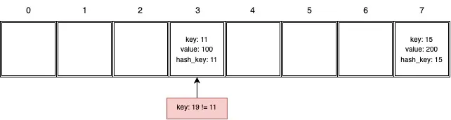

### Hash Tables

Dictionaries in Python nutzen Hash-Tabellen. Um zu verstehen, wie Dictionaries funktionieren, schauen wir uns an, wie Hash-Tabellen aufgebaut sind. Zuerst erstellen wir eine leere Tabelle mit 8 Zellen (der Standardwert, wenn eine Tabelle erstellt wird):


Typischerweise speichert eine Hash-Tabelle in jeder Zelle einen Schlüssel, einen Wert und den Hash des Schlüssels. Schreiben wir einen Wert in die Tabelle, zum Beispiel `100` für den Schlüssel `11`:

```python
dictionary[11] = 100
```

Um diesen Wert in der Tabelle zu speichern, führt Python ein paar Operationen durch:

1.  Findet den Hash-Wert vom Schlüssel:

<!-- end list -->

```python
hash_key = hash(key)		# hash_key = 11
```

2.  Findet den Index, indem der Rest des Hash-Werts des Schlüssels geteilt durch die Größe der Hash-Tabelle genommen wird:

<!-- end list -->

```python
index = hash_key % 8		# index = 3
```

3.  Schreibt den Schlüssel, den Wert und den Hash in die Zelle, die diesem Index entspricht. Die Zellennummerierung beginnt bei `0`:


Fügen wir einen weiteren Wert mit einem Schlüssel von `15` und einem Wert von `200` hinzu:

1.  Findet den Hash-Wert vom Schlüssel:

<!-- end list -->

```python
hash_key = hash(key)		# hash_key = 15
```

2.  Findet den Index:

<!-- end list -->

```python
index = hash_key % 8		# index = 7
```

3.  Der Wert wird in die Zelle geschrieben:


Lesen wir nun einen Wert über den Schlüssel aus einer Tabelle – zum Beispiel Schlüssel `11`:

1.  Findet den Hash-Wert vom Schlüssel:

<!-- end list -->

```python
hash_key = hash(key)		# hash_key = 11
```

2.  Findet den Index:

<!-- end list -->

```python
index = hash_key % 8		# index = 3
```

3.  Geht zur Zelle mit Index `3` und gibt den Wert von dort zurück.

Aber was passiert, wenn der Wert für den Schlüssel *nicht* existiert? Zum Beispiel die Suche nach Schlüssel `4`:

1.  Findet den Hash-Wert vom Schlüssel:

<!-- end list -->

```python
hash_key = hash(key)		# hash_key = 4
```

2.  Findet den Index:

<!-- end list -->

```python
index = hash_key % 8		# index = 4
```

3.  Wir gehen zur Zelle mit Index `4`. Die Zelle ist leer, daher gibt das Programm einen `KeyError` für das Dictionary aus und `None` oder einen anderen Fehler für die Tabelle.

Stell dir nun vor, wir möchten einen Wert für einen Schlüssel abrufen, der nicht existiert, die Zelle aber *nicht leer ist*. Zum Beispiel der Wert für den Schlüssel `19`:

1.  Findet den Hash-Wert vom Schlüssel:

<!-- end list -->

```python
hash_key = hash(key)		# hash_key = 19
```

2.  Findet den Index:

<!-- end list -->

```python
index = hash_key % 8		# index = 3
```

3.  Die Zelle mit dem Index `3` ist nicht leer, aber der Wert für den Schlüssel `11` ist dort gespeichert, also... was kommt als Nächstes? Um Verwirrung in einem solchen Fall zu vermeiden, sollten wir nicht nur die Zellennummer überprüfen, sondern auch den in der Zelle geschriebenen Schlüsselwert — `19 != 11`:

