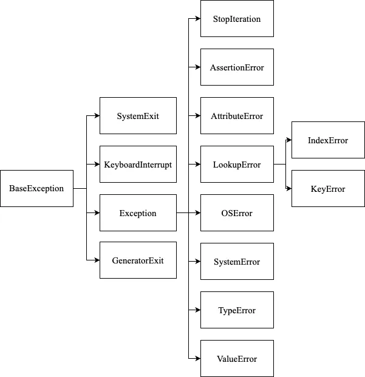

# Exceptions in Details

In dieser Lektion vertiefen Sie Ihr Wissen über Pythons Exceptions.

-----

[](https://www.google.com/search?q=%23exception-hierarchy)

## Exception Hierarchy

Exceptions sind Objekte von Exception-Klassen. Alle Exception-Klassen in Python sind Unterklassen der `BaseException`-Klasse. Alle eingebauten Exception-Klassen erben von der `Exception`-Klasse, die eine Unterklasse von `BaseException` ist. Sie können eine vollständige [Liste der Exception-Hierarchie](https://riptutorial.com/python/example/5535/exception-hierarchy) einsehen, aber wir haben die wichtigsten und am häufigsten verwendeten Exception-Klassen herausgenommen:



-----

[](https://www.google.com/search?q=%23exception-order)

## Exception Order

Manchmal haben Sie Aufgaben, bei denen je nach Programmlauf mehrere verschiedene Fehler auftreten können.

Betrachten wir ein Programm, das zwei vom Benutzer eingegebene Zahlen unendlich oft dividiert. Hierbei können einige Fehler auftreten. Der erste Fehler ist ein ungültiger Wert, der nicht in eine Zahl umgewandelt werden kann. Der zweite Fehler ist, wenn die zweite Zahl gleich Null ist.

Es gibt verschiedene Wege, das Problem mehrerer Fehler zu lösen. Der erste Weg ist, einfach den `try-except`-Block zu verwenden, ohne den Fehler zu spezifizieren. In diesem Fall wird nur ein Fehler angezeigt, und wir wissen nicht, warum der Fehler aufgetreten ist und was behoben werden muss. Dies ist eine schlechte Praxis, wenn Ihr Programm verschiedene Fehler verursachen kann:

```python
while True:
	try:
		first = int(input())
		second = int(input())
		print(first / second)
	except:
		print("Error")
```

Der zweite Weg ist, von der Basisklasse `Exception` zu erben, aber dies ist ebenfalls eine schlechte Praxis, da Sie separate Fehler nicht separat behandeln und möglicherweise andere unerwartete Fehler auftreten, die Sie nicht behandeln möchten:

```python
while True:
	try:
		first = int(input())
		second = int(input())
		print(first / second)
	except Exception as error:
		print("Error: ", error)
```

Der Unterschied zwischen dem ersten und dem zweiten Beispiel besteht darin, dass Sie im zweiten Beispiel auf die Attribute des `Exception`-Objekts zugreifen können.

Der beste Weg ist, mehrere `except`-Blöcke zu verwenden und verschiedene Klassen zur Behandlung von Exceptions anzugeben. Darüber hinaus kann jeder `except`-Block seinen eigenen Handler haben:

```python
while True:
	try:
		first = int(input())
		second = int(input())
		print(first / second)
	except TypeError as e:
		print("Both values must be numbers ", e)
	except ZeroDivisionError as e:
		print("You are trying to divide by zero ", e)
	except KeyboardInterrupt as e:
		print("The program is completed ", e)
```

In diesem Beispiel haben wir die `KeyboardInterrupt`-Exception hinzugefügt, die aufgerufen wird, wenn eine Person das Programm mit der Tastenkombination `Ctrl (Command)` + `C` beenden möchte.

Denken Sie daran: Wenn wir mehrere Fehler haben, ist es sehr wichtig, die Reihenfolge der angegebenen Fehler zu beachten, da die Reihenfolge vom ersten zum letzten Fehler verläuft. Wichtigere und häufigere Fehler sollten zuerst angegeben werden.

-----

[](https://www.google.com/search?q=%23re-raise-exception)

## Re-Raise Exception

Verwenden Sie das Schlüsselwort `raise`, um einen Fehler erneut auszulösen. Das erneute Auslösen einer Exception ist notwendig, wenn wir möchten, dass der Fehler mehrmals ausgeführt wird. Zum Beispiel, das erste Mal in einer Funktion und das zweite Mal in einem Block, in dem diese Funktion aufgerufen wird. Betrachten wir ein Beispiel:

```python
def divide(a: int, b: int) -> int:
	try:
		return a // b
	except ZeroDivisionError:
		print("Unable to divide")
		raise


input = [(2, 1), (10, 5), (3, 0)]
result = []
for numerator, denominator in input:
	try:
		result.append(divide(numerator, denominator))
	except ZeroDivisionError as error:
		result.append(0)
		print(f"Error: {error} for denominator {denominator}")
	
```

Wenn Sie in diesem Beispiel das `raise` nicht verwenden, wird der Wert `None` in die Ergebnisliste geschrieben. Da der Fehler nur einmal innerhalb der Funktion `divide` aufgerufen wurde, wird er in der Schleife nicht erneut aufgerufen.

-----

[](https://www.google.com/search?q=%23exception-performance)

## Exception Performance

Denken Sie daran, dass die Verwendung des `try-except`-Blocks begrenzt sein sollte. Manchmal trägt er keine funktionale Last, verlangsamt aber gleichzeitig das Programm.

Vergleichen wir zwei Code-Beispiele:

```python
my_dict = {}

for _ in range(1000):
	try:
		print(my_dict["a"])
	except KeyError:
		pass


# 0.000128 seconds


for _ in range(1000):
	if "a" in my_dict:
		print(my_dict["a"])

# 0.0000498 seconds
```

In diesem Beispiel arbeitet der `try-except`-Block langsamer als eine einfache Überprüfung mit der `if`-Anweisung.