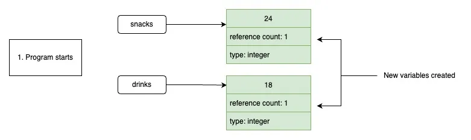
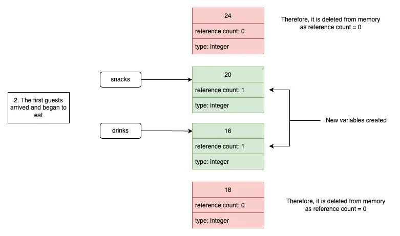
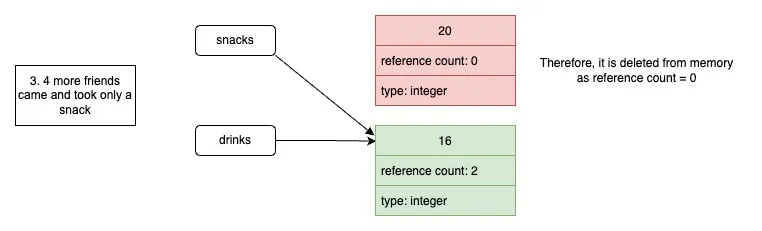
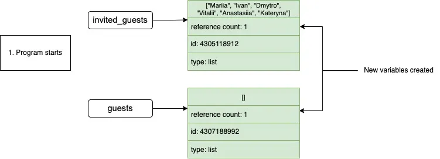
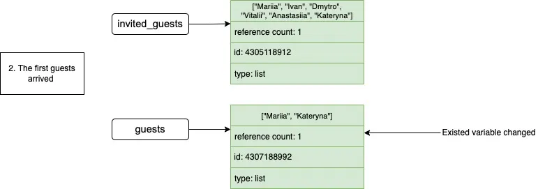
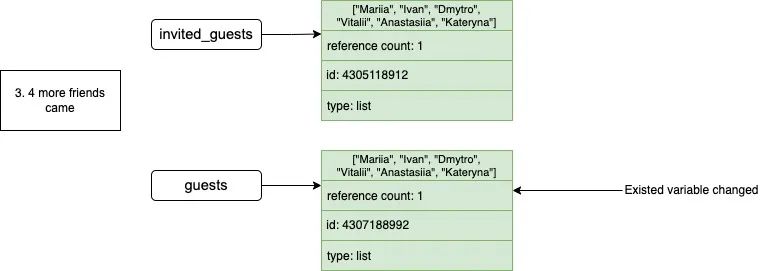
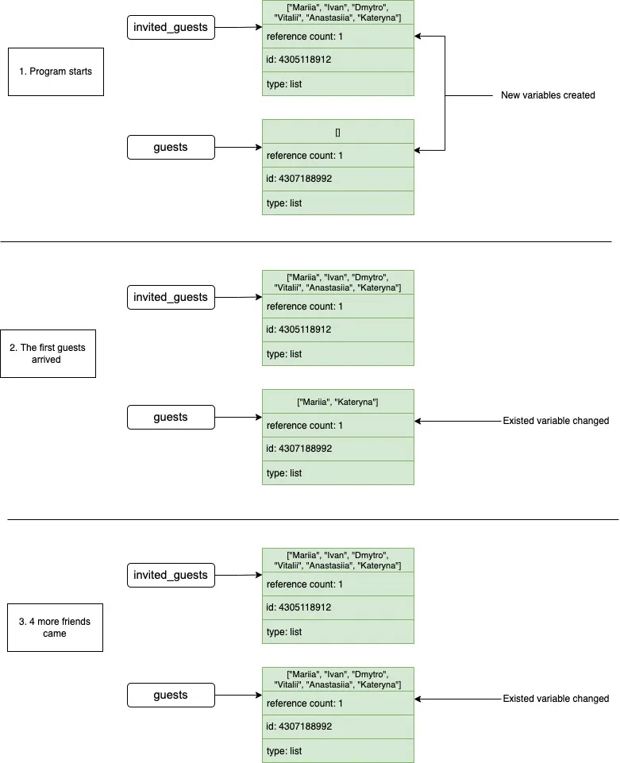
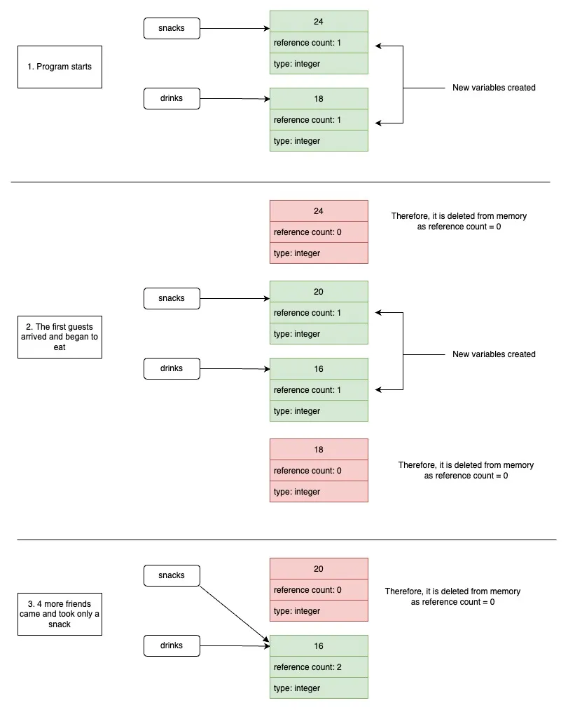

Konvertiere den bereitgestellten HTML-Code in das entsprechende Markdown-Format.

-----

[\<a href="\#garbage-collector" target="\_self"\>](https://www.google.com/search?q=%23garbage-collector)

## Garbage Collector

*Garbage collection* in Python ist ein Speicherverwaltungsprozess, der **ungenutzten und unerwünschten Speicher für unsere Programme freigibt**. Der Garbage Collector findet Objekte ohne Referenzen und entfernt sie aus dem Heap-Speicher mithilfe eines Algorithmus zur Referenzzählung.

Als Beispiel stellen wir uns vor, wir veranstalten eine Party mit Getränken und Snacks. Wir können eine Funktion erstellen, um die verbleibenden Getränke und Snacks zu zählen:

```python
def eat(current_amount: int, eat_number: int) -> int:
	return current_amount - eat_number
```

1.  Zu Beginn der Party gibt es `18` Getränke und `24` Snacks:

<!-- end list -->

```python
snacks = 24
drinks = 18
```



2.  Die ersten Gäste kamen, aßen ein paar Snacks und tranken ein paar Getränke:

<!-- end list -->

```python
snacks = eat(snacks, 4)		# snacks = 20
drinks = eat(drinks, 2)		# drinks = 16
```



3.  Vier weitere Freunde kamen und hatten nur Snacks:

<!-- end list -->

```python
snacks = eat(snacks, 4)	# snacks = 16
```



Voilà: Die Anzahl der Getränke und Snacks hat sich ausgeglichen. Tatsächlich haben Getränke und Snacks nun eine einzige Speicherzellenreferenz:

```python
print(id(snacks))	# 9789472
print(id(drinks))	# 9789472
```

> Für unveränderliche Objekte ist der Wert der Referenzanzahl höher als in den Bildern angegeben, wie bereits in den vorherigen Abschnitten erwähnt.

Betrachten wir ein ähnliches Beispiel mit einem veränderlichen Datentyp, wie einer `list`. Stellen wir uns vor, die Party geht weiter, aber von nun an protokollieren wir die Namen der Gäste, die vorbeikamen, in der Liste `guests`. Es gibt auch eine Liste `invited_guests` von `6` eingeladenen Freunden:

```python
invited_guests = ["Mariia", "Ivan", "Dmytro", "Vitalii", "Anastasiia", "Kateryna"]
guests = []
```



Zunächst kamen `2` Personen:

```python
guests += ["Mariia", "Kateryna"]
```



Dann kamen `4` weitere hinzu:

```python
guests += ["Ivan", "Dmytro", "Vitalii", "Anastasiia"]
```



Inzwischen sind alle eingeladenen Freunde aufgetaucht, sodass unsere Listen identisch sind – was sich im Speicher widerspiegelt:



Da `list` ein veränderlicher Datentyp ist, ändert sich seine ID beim Hinzufügen neuer Elemente nicht. So bleiben selbst bei gleichem Inhalt zwei Listen zwei verschiedene Objekte im Speicher.

Der Garbage-Collection-Algorithmus von Python gibt Speicherplatz auf zwei Arten frei: durch *Referenzzählung* und einen *generativen Algorithmus*. Wenn die **Referenzanzahl** eines Objekts Null erreicht, bereinigt der Garbage-Collection-Algorithmus zur Referenzzählung das Objekt sofort – wie oben erläutert.

Der **generative Algorithmus** behandelt Zyklen, in denen die Referenzanzahl nicht Null erreicht, wartet, um zu laufen und das Objekt zu bereinigen. Hier ist ein Diagramm zur besseren Erklärung:



Der Garbage Collector verfolgt alle Objekte im Speicher, die in drei Generationen unterteilt sind, von der neuesten (Generation 1) bis zur ältesten (Generation 3). Sobald die Schwellenwertanzahl der Objekte in einer Generation erreicht ist, löst der Garbage Collector einen Bereinigungsprozess aus. Wenn ein Objekt überlebt, wird es in die nächste Generation verschoben, bis es ebenfalls verschwindet.

Im Gegensatz zur Referenzzählung können wir das Verhalten des generativen Garbage Collectors anpassen. Dazu gehören das Ändern der Schwellenwerte für die Auslösung der Bereinigung, das manuelle Auslösen der Bereinigung oder das vollständige Deaktivieren.